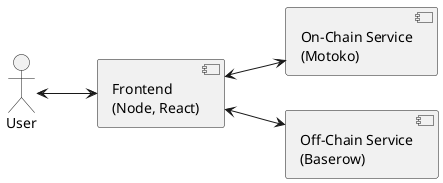
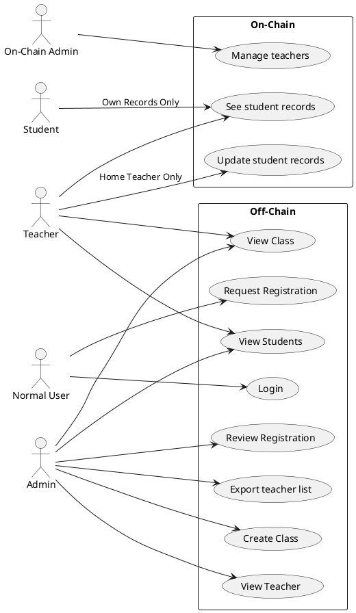

# EduBlock

## Introduction

This is the specification for a student record system that store the student records on the BlockChain network. The system is designed to provide a user-friendly interface for teachers to update their students' academic records and a full replacement of traditional academic record papers.

## About Existing System

Many high schools in Viet Nam use one of existing online systems to store students' academic records and notify their parents about recent records, but they still use traditional record papers for post-graduation & university / college enrollment. Therefore, The teachers find it difficult to update their students' records because they have to update the records on both the online system & the record paper. Moreover, the online system is a centralized system that only the admins and the teachers can see and interact, so there is little transparency for students who want to see their records at any time.

## User Requirement

### Main Function
1. Normal User
   * Request Registration
     * The user must fill a form of personal information
     * The user must choose a role to request: Student or Teacher
     * The user can send the request form and wait for an admin to review
   * Login
     * The user must have an account on the system to login
2. Student
   * See Student Records
     * The user must login to use this function
     * The user can only see his academic records
3. Teacher
   * View Class
     * The user must login to use this function
     * The user can only see his own classes
     * The user can filter his classes by name or year
   * View Student
     * The user must login to use this function
     * The user can only see his own classes
     * The user can choose a class and see its student
     * The user can filter his students by name
   * Update Student Records
     * The user must login to use this function
     * The user can only update students of his classes
     * The user can choose a student and see his academic records
     * The user can update the student's records
4. Admin
   * View Class
     * The user must login to use this function
     * The user can see created classes
     * The user can filter the classes by name or year
   * Create Class
     * The user must login to use this function
     * The user must assign a teacher to the class as a home teacher
     * The user must assign students to the class
   * View Student
     * The user must login to use this function
     * The user can see registered students
     * The user can filter the students by name
   * View Teacher
     * The user must login to use this function
     * The user can see registered teachers
     * The user can filter the teachers by name
   * Review Registration
     * The user must login to use this function
     * The user can see the waiting requests
     * The user can accept or deny a request
     * The user can filter the requests by username or fullname
     * For teacher requests, the user can export a list to give to the On-Chain Admin
5. On-Chain Admin
   * Add/Remove Teachers
     * The user must interact with the BlockChain (On-Chain) service to use this function
     * The user can add or remove a list of teachers received from the Admin

### Non-Function
* The system easy to maintain & upgrade
* The user interface is clear, idiot-proof, easy to use & friendly
* The system is available on 24/7

## System Requirement

### System Component

| Component | Description |
| --- | --- |
| Frontend | The interface of the system, responsible for UI/UX |
| Off-Chain Service | Store the personal information of the user, the registration requests and the details of classes & students |
| On-Chain Service | Store the student's academic records by grade & Allow teachers to update their students' records |

### Actor Description
| Actor | Description |
| --- | --- |
| Student | The smallest actor of the system who can only see his academic records |
| Teacher | A person who can update the student's academic records |
| Admin | A manager of the system who manage teachers, classes & students |
| On-Chain Admin | A subset of Admin who interacts with the On-Chain service |

### Use case diagram
